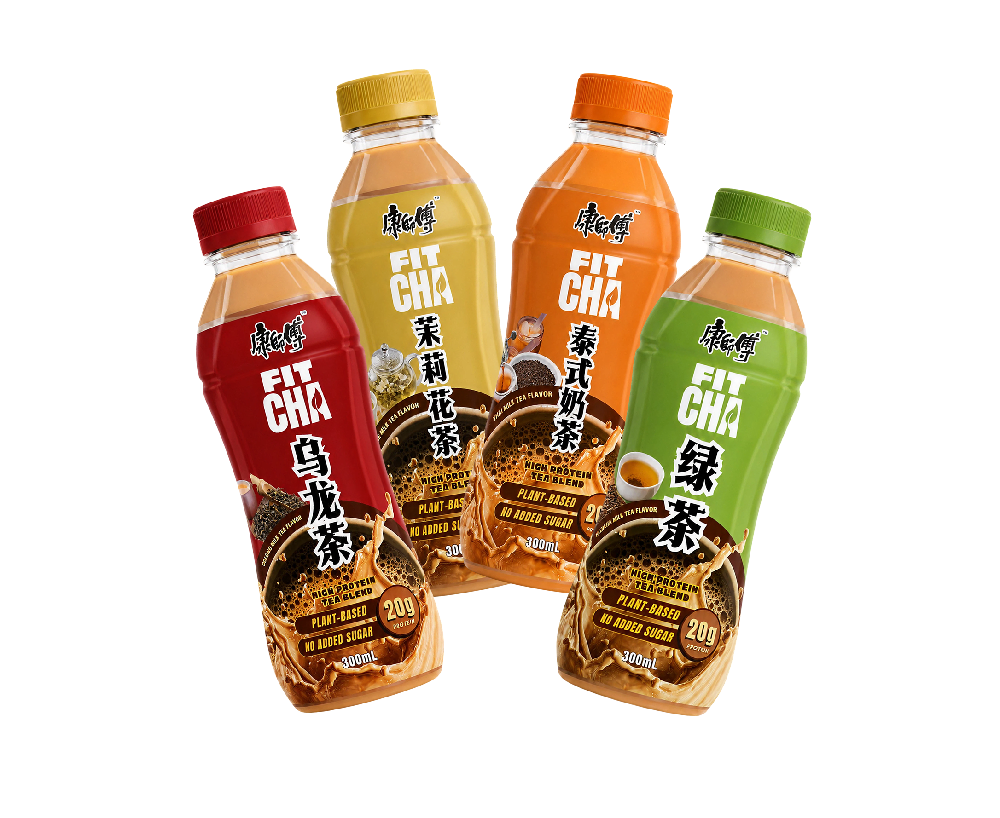

# Fitcha Website



Fitcha Website is a single-page CSV analysis dashboard for a high-protein, plant-based milk tea concept. Upload Google Form responses to compare tea directions, see the top product direction, and generate a first-pass formulation guide.

## Highlights

- Modern landing dashboard with entrance animation
- EN / ID language toggle
- CSV upload with drag-and-drop support
- "Get started" button that scrolls users to the upload box
- Product mockups for Oolong, Jasmine, Hojicha, and Thai Tea
- Top Direction result now shows the matching product photo
- Compatibility scoring for Oolong, Jasmine, Hojicha, and Thai Tea
- Summary outputs for market gap, decision signals, masking fit, and formulation reasoning

## Formulation Update

The latest formulation model uses:

- Fixed serving size: 300 mL
- Protein target: 20 g protein
- Pea protein isolate: 22.2 g, based on 90% protein yield
- Added oat milk, inulin, stevia + erythritol, water top-up, and estimated calories

## Local Preview

Open `index.html` directly in a browser, or run a simple static server:

```bash
python -m http.server 4173
```

Then open:

```text
http://localhost:4173
```

## Deploy to Vercel

1. Push this repo to GitHub.
2. In Vercel, click "Add New" -> "Project".
3. Import the repo and keep the framework as "Other" or static.
4. Build command: leave empty.
5. Output directory: leave empty.
6. Deploy.

## Notes

- The app runs entirely in the browser. No backend required.
- CSV should be exported from Google Forms / Google Sheets.
- Output is an AI-assisted estimate, not a validated sensory result.
- This project is from Gari/Arinal Haq Team; @Tiyouw helps with improvements and deployment.
